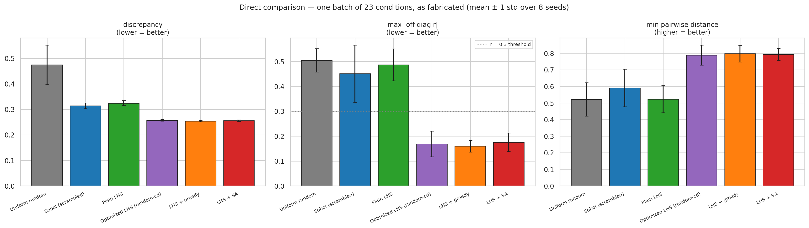
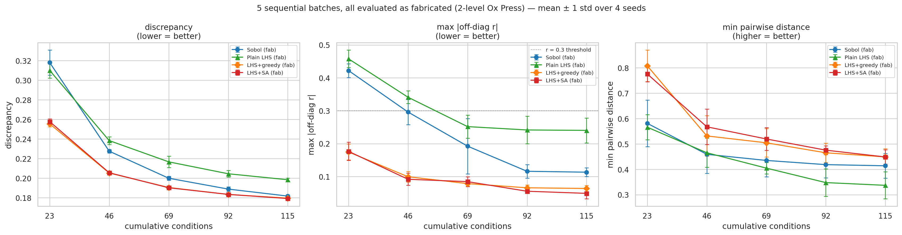
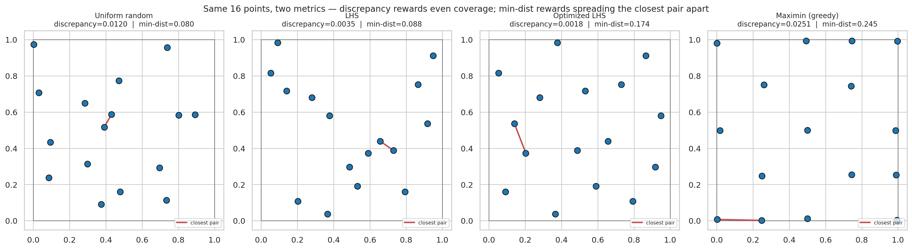
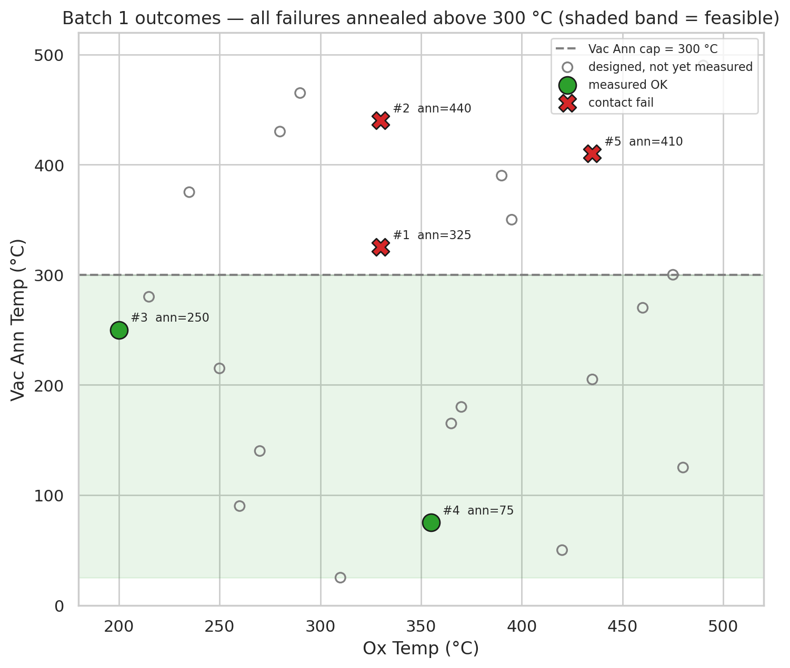
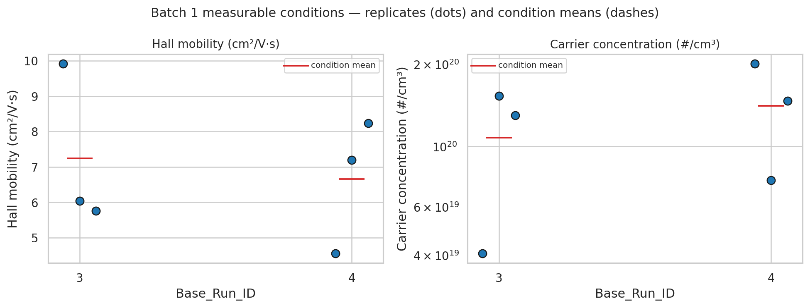
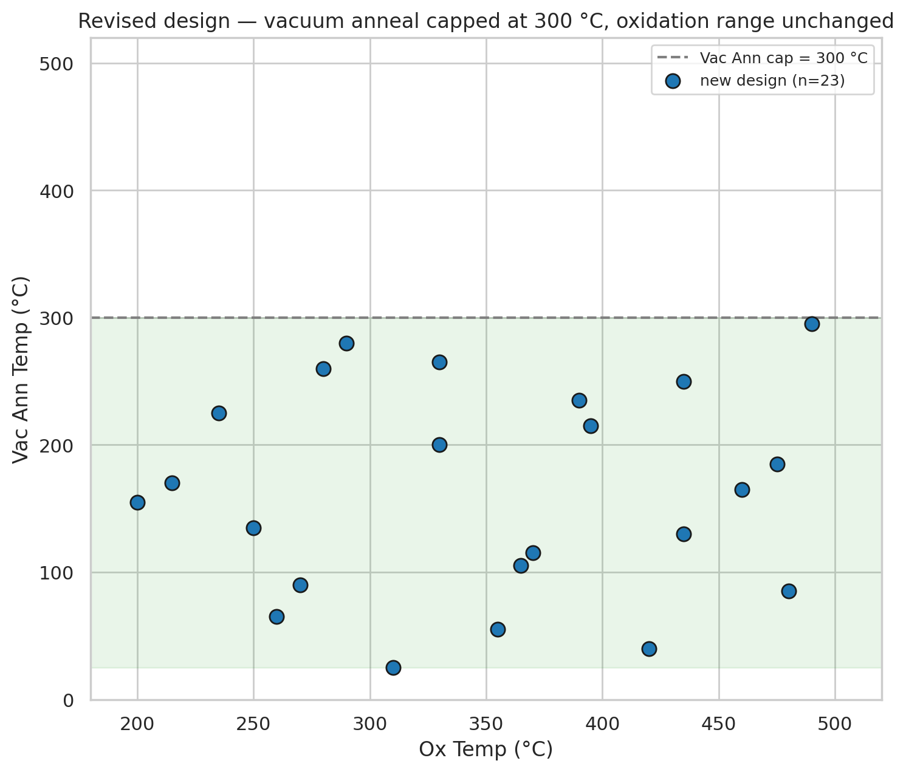
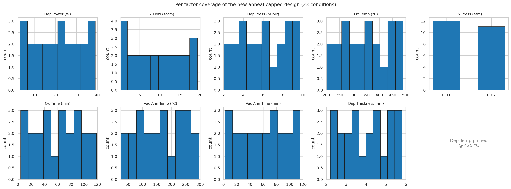
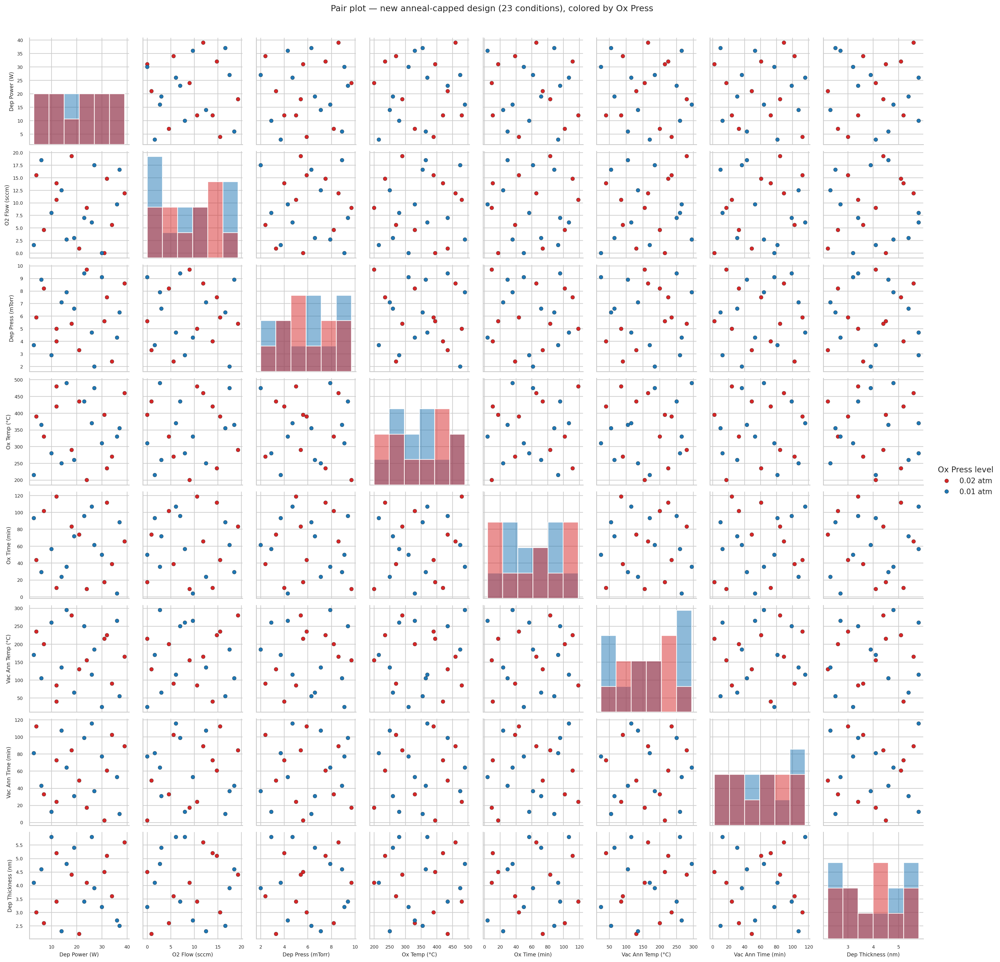

# Experiment 03 — PdO on HfO₂: Project Status

*Status as of July 31, 2026 — prepared as source material for the project presentation.*

**The story in three acts:**

1. **We generated a space-filling DoE** for the first PdO-on-HfO₂ campaign, selecting **LHS + simulated annealing** over Sobol, plain LHS, optimized LHS, and LHS+greedy in a fair, as-fabricated benchmark.
2. **The first fabrication delivery revealed a hidden constraint**: 3 of 5 conditions contact-failed, all of them vacuum-annealed above 300 °C → new process rule **Vac Ann Temp ≤ 300 °C**.
3. **We generated a brand-new DoE under the corrected bounds** — same machinery, capped anneal — ready for fabrication.

---

## 1. The generated DoE (initial design)

**Problem.** First space-filling design for PdO on HfO₂ — no data existed yet. PdO on HfO₂ decomposes at ≥ ~510 °C (vs ~695 °C on Al₂O₃), so both thermal steps were individually capped below 500 °C and deposition temperature pinned at 425 °C.

**Factors (9 swept + 1 pinned):**

| # | Factor | Range | Resolution |
|---|--------|-------|------------|
| 1 | Dep Power (W) | 2 → 40 | 1 W |
| 2 | O₂ Flow (sccm) | {0} ∪ 0.3 → 20 | 0.1 sccm |
| 3 | Dep Press (mTorr) | 2 → 10 | 0.1 mTorr |
| 4 | Ox Temp (°C) | 200 → 500 | 5 °C |
| 5 | Ox Press (atm) | {0.01, 0.02} | 2 levels |
| 6 | Ox Time (min) | 0 → 120 | 0.1 min |
| 7 | Vac Ann Temp (°C) | 25 → 500 | 5 °C |
| 8 | Vac Ann Time (min) | 0 → 120 | 0.1 min |
| 9 | Dep Thickness (nm) | 2 → 6 | 0.1 nm |
| 10 | Dep Temp (°C) | **pinned 425** | — |

**Method selection.** Six candidate generators were benchmarked **as fabricated** (every design snapped to the tool resolution grid, including the 2-level Ox Press, before scoring), on one batch of 23 conditions (mean over 8 seeds) and over a 5-batch sequential campaign (4 seeds):

| Method | Discrepancy ↓ | max \|off-diag r\| ↓ | Min pairwise dist ↑ |
|--------|--------------|----------------------|---------------------|
| Uniform random | 0.474 | 0.51 | 0.52 |
| Sobol (scrambled) | 0.313 | 0.45 | 0.59 |
| Plain LHS | 0.324 | 0.49 | 0.52 |
| Optimized LHS (random-cd) | 0.257 | 0.17 | 0.79 |
| LHS + greedy | 0.254 | 0.16 | 0.80 |
| **LHS + SA (chosen)** | **0.256** | **0.18** | **0.79** |

**Decision.** The two conditional column-swap optimizers dominate on every metric; greedy and SA are statistically tied on a single batch, but **LHS+SA holds the lower worst-pair correlation as batches accumulate** (0.049 vs 0.064 at 115 conditions) and extends cleanly to future batches by freezing fabricated runs — so LHS+SA was chosen. Sobol's asymptotic advantage only appears at n ≈ 400+, far beyond a realistic campaign.

**The exported design:** 23 conditions × 3 replicates = 69 rows, fabricated discrepancy 0.2525, max |off-diag r| = 0.098.

- Notebook: [`analysis/doe/experiment03_hfo2_doe_design.ipynb`](analysis/doe/experiment03_hfo2_doe_design.ipynb)
- Run sheet: `output/experiment03_hfo2_doe_design/PdO_HfO2_LHS_SA_design.xlsx`
- Presentation figures:
  - 
  - 
  - 

---

## 2. First delivery — the realization of the new temperature constraint

**Received (2026-07-31):** design conditions **1–5 × 3 replicates** with Hall mobility and carrier concentration. Every factor value matched the generated DoE exactly — fabricated as designed.

**Results:**

| Condition | Ox Temp (°C) | Vac Ann Temp (°C) | Outcome |
|-----------|--------------|-------------------|---------|
| #1 | 330 | **325** | Contact fail (×3) |
| #2 | 330 | **440** | Contact fail (×3) |
| #3 | 200 | 250 | Mobility 5.8–9.9 cm²/V·s, carrier 4.1×10¹⁹–1.5×10²⁰ cm⁻³ |
| #4 | 355 | 75 | Mobility 4.6–8.2 cm²/V·s, carrier 7.5×10¹⁹–2.0×10²⁰ cm⁻³ |
| #5 | 435 | **410** | Contact fail (×3) |

**The realization.** Every run respected the individual < 500 °C caps, yet 3/5 conditions failed. The outcomes separate perfectly by **vacuum-anneal temperature**: successes annealed at 75 and 250 °C, failures at 325, 410, 440 °C. The fab team's process explanation: **PdO decomposes at much lower temperature in vacuum than in oxygen**, so the new process constraint is

> **Vac Ann Temp ≤ 300 °C** (oxidation range unchanged, 200–500 °C)

This mirrors the experiment02 precedent on Al₂O₃, where Batch 2 capped only the vacuum-anneal (at 550 °C there; lower on HfO₂). Under the cap, only 14 of the original 23 conditions remain feasible — so the design was regenerated rather than patched. Note also the large replicate scatter on the good conditions (CV ≈ 30–60%), which supports the planned SEM²-noise GP treatment downstream.

- Notebook: [`analysis/received_data_analysis/experiment03_hfo2_batch1_analysis.ipynb`](analysis/received_data_analysis/experiment03_hfo2_batch1_analysis.ipynb)
- Transcribed data: `output/experiment03_hfo2_batch1_analysis/received_batch1_transcribed.xlsx` *(source was a screenshot — replace with the raw file when it lands in `raw_data_received/`)*
- Presentation figures:
  - 
  - 

---

## 3. The new DoE with the new temperature bound

A **brand-new LHS+SA design** (not conditioned on the previous table) generated with the identical machinery — the only change is the bound **Vac Ann Temp: 25 → 300 °C**:

- **23 conditions (IDs 1–23) × 3 replicates = 69 rows**, seed 20
- Vac Ann spans 25–295 °C (all under the cap); oxidation uses its full 200–500 °C range
- Ox Press split 12/11; unit-cube discrepancy 0.0681
- The measured #3 and #4 from the old design lie inside the new bounds and remain valid extra data points for the GP — nothing from the first delivery is wasted

- Run sheet: **`output/experiment03_hfo2_batch1_analysis/PdO_HfO2_LHS_SA_design_v2_anncap300.xlsx`** (design_full / design_unique / config / provenance)
- Presentation figures:
  - 
  - 
  - 

> ⚠️ The new sheet reuses IDs 1–23, which collide with the old design's numbering (the delivered runs were old #1–5). The `Batch` column ("Batch 1 (anneal-capped)") and the provenance sheet disambiguate — state the design generation explicitly when circulating the run sheet.

---

## Next steps

1. **Fabricate** the anneal-capped batch (69 rows).
2. On data return: mirror `experiment02_pdo_analysis.ipynb` — preliminary analysis, ANOVA, replicate CV, regression validation, factor effects.
3. Start the **multi-objective Bayesian optimization** loop (GP + qLogNEHVI, reusable code in [`utils/mobo.py`](utils/mobo.py)), treating `Contact Fail` outcomes as feasibility observations.

## Key files at a glance

| Purpose | Path |
|---------|------|
| Consolidated DoE study (method comparison + initial design) | `analysis/doe/experiment03_hfo2_doe_design.ipynb` |
| Batch-1 data analysis + anneal-capped redesign | `analysis/received_data_analysis/experiment03_hfo2_batch1_analysis.ipynb` |
| Original (superseded) run sheet | `output/experiment03_hfo2_doe_design/PdO_HfO2_LHS_SA_design.xlsx` |
| **Current run sheet (send this one)** | `output/experiment03_hfo2_batch1_analysis/PdO_HfO2_LHS_SA_design_v2_anncap300.xlsx` |
| LHS+SA optimizer tutorial (build-it-yourself) | `analysis/tutorial/lhs_sa_build_it_yourself.ipynb` |
| Exploratory originals (archived) | `analysis/temp/experiment03_hfo2_{sobol,doe}_design.ipynb` |
| Reusable GP + MOBO code | `utils/mobo.py` |
